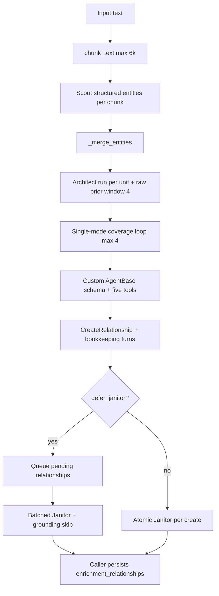
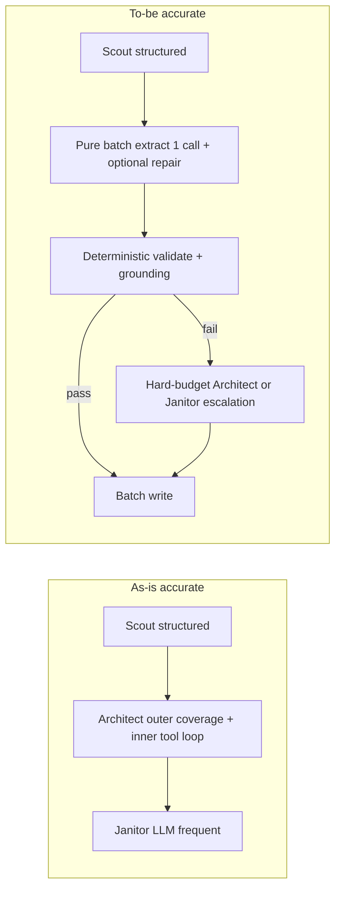

# 11 — Architect ingest loop efficiency (peer-competitive tokens)

Workstream: cut accurate-mode **ingest** LLM token multipliers by roughly an order of magnitude while preserving event-hub graph shape and LoCoMo / LongMemEval quality bars in [`00-scope-and-constraints.md`](00-scope-and-constraints.md) and [`10-ingest-cost-latency.md`](10-ingest-cost-latency.md). Architecture changes to the Architect loop **are allowed**. `PIPELINE_MODE=lightweight` remains **out of scope** as a cost lever. Retrieval `/retrieve/context` must stay cheap (no query-time LLM loops).

Extraction quality ownership stays with [`01-ingestion-extraction.md`](01-ingestion-extraction.md); this document owns the **Architect / Janitor control-flow redesign** that dominates measured spend.

---

## Problem statement (measured)

### Baseline A/B (2026-07-30)

Source: [`benchmarks/runs/ingest-cost-baseline.json`](../../benchmarks/runs/ingest-cost-baseline.json) — LoCoMo `conv-26`, sessions 1–5, `PIPELINE_MODE=accurate`.

| Arm | mean wait | mean LLM tokens / session | Architect mean tokens | Janitor mean tokens | Architect+Janitor share |
| --- | ---: | ---: | ---: | ---: | ---: |
| Legacy hotpath (`ingest-cost-legacy`) | 630 s | **1.19M** | 1.19M (Janitor folded into Architect) | (folded) | ~99%+ |
| Cheap defaults (`ingest-cost-cheap2`) | 223 s | **0.73M** | 0.38M | 0.34M | **99.5%** |

C0–C3 shipping (per-unit Architect, deferred batched Janitor, Observations/consolidator off, grounding precheck) already cut mean wait ≈65% and mean tokens ≈39%. **Scout remains ~0.5% of spend** (~3.8k tokens / session). **Post-CP3 ship path:** batch+scratchpad is **~15.3×** source tokens vs cheap **~886×** — see multiplier section and `architect-cp2-NOTES.md` / `architect-cp3-NOTES.md`.

### Token multiplier vs source text

Pinned denominator: **tiktoken `cl100k_base`**, 4,114 source tokens on conv-26 sessions 1–5 (`ingest-cost-baseline.json`).

| Era | Arm | LLM÷source |
| --- | --- | ---: |
| Pre-redesign | Cheap defaults (`ingest-cost-cheap2`) | **~886×** |
| CP2 | Batch + raw prior (`architect-cp2-NOTES.md`) | **18.8×** |
| CP3 (ship) | Batch + scratchpad (`architect-cp3-NOTES.md`) | **15.3×** |

Old cheap ~886× → batch+scratchpad ~15.3× on the same five sessions. The **≤100×** ship gate is met; stretch 20–50× is also met.

The requested **20–100×** band remains a peer-shaped engineering target, not a published apples-to-apples LightRAG/Graphiti comparison.

### Why spend concentrates in Architect+Janitor

Traced current workspace path:

1. Scout emits structured entities per ≤6k-character unit (`scout_agent.py:385-410`, `:503-533`)—already close to the peer control-flow shape.
2. `auto_kg.py:156-194` calls Architect once per Scout unit by default, passing the current unit plus up to four prior raw units (`auto_kg.py:33`, `:70-77`).
3. The call is `ArchitectAgent.run(...)`, not `run_tooler` (`auto_kg.py:171-183`). `ArchitectAgent` defaults to `agent_mode="single"` (`architect_agent.py:257-268`), so `run()` dispatches through `_run_single()` to `run_structured()` (`architect_agent.py:593-633`, `:1161-1193`).
4. “Structured” is not one-shot here. `run_structured()` binds five state/relationship tools **and** `ArchitectAgentSingleResponse` (`architect_agent.py:1203-1243`), then runs an outer coverage loop up to four times (`:1245-1328`). Each outer iteration can enter the custom `AgentBase` tool loop.
5. The custom backend is the default (`config.py:584-586`; `runtime_agent_factory.py:25-37`). It sends the accumulated `agent.messages` on every next tool turn (`invoke_loop.py:372-428`, `:432-502`) and has tracing thresholds but no explicit `tool_loop_count` termination guard (`invoke_loop.py:110-147`, `:432-445`). Native tool schemas, the output schema, the long system prompt, source text, state, and prior tool results therefore recur in billed context.
6. The outer Architect loop also re-adds the same source-bearing user prompt, full entity state, and prior generated relationship summaries (`architect_agent.py:1230-1240`, `:1262-1318`). The state tools themselves return complete remaining/used entity lists (`ArchitectAgentGetRemainingEntitiesToProcessTool.py:50-64`; `ArchitectAgentCheckUsedEntitiesTool.py:53-62`), while `CreateRelationship` accepts one edge per call (`ArchitectAgentCreateRelationshipTool.py:177-204`).
7. The cheap arm measures **33.4 Architect calls** and **19.8 Janitor calls** per session (`ingest-cost-baseline.json:115-127`), with 17–56 Architect calls across the five sessions (`:137-176`). Architect averages about **11.4k tokens per model call** (379,505 / 33.4), consistent with context re-send rather than output volume alone.
8. Batched Janitor still consumes ≈344.8k tokens/session after the cheap grounding precheck (`architect_agent.py:328-440`; `grounding.py:90-116`)—about 47% of total cheap-arm spend.

There is therefore a structured **schema**, but no pure, side-effect-free, provider-constrained extraction path with `tools=[]`, one response, and a hard repair budget. That missing path—not merely “switching to `run_structured`”—is the first architectural lever.

One attribution caveat remains: `ingest-cost-baseline.json` records ingest flags but not the running server checkout or Architect mode, and the workspace/live runtime may differ. The cost numbers are observed; assigning every measured call to the current source path remains an inference until Task 0.2 records runtime code identity.

### Token-amplification decomposition

- **Call count:** 33.4 Architect and 19.8 Janitor model calls/session in the cheap arm; the current source permits multiple inner tool turns inside each of up to four outer attempts per Scout unit.
- **Context re-send:** each next inner turn invokes the model with accumulated messages, while each outer attempt reconstructs the source-bearing user prompt and entity state; successful prior relationships are summarized back into later attempts.
- **Prompt and schema overhead:** the single-mode system prompt is substantial (`src/constants/prompts/architect_agent.py:205-269`); the custom runtime adds tool descriptions and a flattened output schema (`src/core/agents/core/prompts.py:27-63`), and native binding attaches all tool schemas (`agent_base.py:58-66`). Those fixed instructions recur on every model request before source/history tokens.
- **Tool design:** complete entity lists are read back through bookkeeping tools, and relationship creation is edge-granular even though the desired output is a batch. These tools mostly expose in-process state, not new external information that would justify model observation.
- **Missing direct path:** `ArchitectAgentSingleResponse` is a useful contract, but the function named `run_structured()` still binds tools and loops. BrainAPI lacks a `tools=[]`, provider-constrained, validate-then-persist path with a one-repair ceiling.

### Quality reality (binding)

From `00` / Phase 1: graph hygiene improved; graph channel still does **not** reliably beat passages on LoCoMo judge accuracy (noise floor ~5–7 pts). Do **not** claim quality wins from single-run judge deltas. Prefer graph hygiene + retrieval-side metrics + paired McNemar gates.

---

## What this workstream does (as-is)



Anchors:

| Step | Location |
| --- | --- |
| Orchestration | `auto_kg.py:120-267` |
| Per-unit Architect text | `auto_kg.py:70-77`, `_PRIOR_UNIT_WINDOW=4` |
| Default single dispatch | `architect_agent.py:257-268`, `:593-633`, `:1161-1193` |
| Outer structured coverage loop | `architect_agent.py:1203-1328` |
| Inner custom tool loop | `invoke_loop.py:118-147`, `:372-502` |
| Create + optional inline Janitor | `ArchitectAgentCreateRelationshipTool.py:383-411` |
| Batched Janitor | `architect_agent.py:328-440` |
| Grounding skip | `grounding.py:90-116` |
| Cost ledger | `ingest_cost.py` via `track_stage` |
| Knobs | `config.py` (`JANITOR_BATCH_SIZE`, `INGEST_ARCHITECT_PER_UNIT`, `INGEST_DEFER_JANITOR`, `INGEST_ARCHITECT_MODE`, `INGEST_ARCHITECT_PRIOR_CONTEXT`, `INGEST_ARCHITECT_SCRATCHPAD_TOKEN_CAP`, `PIPELINE_MODE`) |

**Guarantee this path tries to provide:** every Scout entity is considered for event-centric relationships, and submitted relationships are structurally checked or explicitly deferred to batched Janitor before provenance-stamped persistence.

**Where it breaks:** reaching the four-iteration outer cap only logs remaining entities and continues (`architect_agent.py:1320-1328`), so “every entity considered” is not a hard outcome; the inner custom tool loop is not explicitly bounded; repeated state and source context dominate input; Janitor remains a second full LLM agent for most edges.

---

## Guarantees and where they break

Ranked by impact on **token multiplier** (then quality risk):

1. **Nested invocation is the cost model.** The current “single” path still combines an outer four-pass coverage loop with a generic stateful tool loop. At ~33 Architect calls/session, this is an architectural gap, not a missing temperature or prompt knob.
2. **The structured path is prompt-enforced, tool-coupled, and retry-prone.** The default custom backend injects/recovers JSON rather than guaranteeing one provider-constrained response (`runtime_agent_factory.py:25-43`; `prompts.py:27-63`). A schema parse can coexist with prior tool turns and side effects.
3. **Tools are too stateful and too granular.** Relationship creation is one edge per tool invocation; remaining/used queries resend full entity lists; model turns are being spent on bookkeeping that deterministic Python already owns.
4. **Janitor is still ~47% of cheap-arm tokens.** Grounding skip helps, but LLM Janitor remains the normal path rather than the exception path.
5. **Raw prior context is a quality/cost trade-off.** Up to four prior units are repeated for cross-unit coreference (`auto_kg.py:70-77`). Compaction could save input tokens but has weaker evidence than bounded extraction and can erase antecedents.
6. **Event hubs and temporal attribution are constraints, not expendable overhead.** Replacing Architect with naive binary NER/RE or `lightweight` would abandon the product differentiator.
7. **The benchmark cannot certify small judge changes.** The ~5–7pp judge noise floor means cost and deterministic graph/retrieval metrics are primary early gates; paired McNemar is appropriate only for end-to-end binary answer outcomes, and a non-significant result is not proof of equivalence.

---

## Frontier techniques

### Retrieval provenance

- **Query:** cheap high-quality LLM KG construction; structured extraction and constrained decoding; Architect-loop alternatives (ATOM, Distill-SynthKG, Zep/Graphiti, LightRAG, MS GraphRAG, ReWOO, LLMCompiler, JSONSchemaBench, EDC, SafePassage, UCCI, Engram).
- **Databases:** arXiv (primary, Atom via `arxiv_atom.py`), OpenAlex (LazyGraphRAG resolution), Microsoft Research blog (LazyGraphRAG — not on arXiv).
- **Access date:** 2026-07-30.

### Sources and applicability

| Paper / source | Claim (as stated) | Evidence quality | Applicability to BrainAPI |
| --- | --- | --- | --- |
| **ATOM** [2510.22590](https://arxiv.org/abs/2510.22590) | Atomic self-contained facts → parallel TKG merge; ~18% exhaustivity, ~33% stability, **&gt;90% latency cut** vs baselines | Peer-reviewed track (EACL 2026 Findings); empirical TKG metrics; **not** LoCoMo/LongMemEval QA | **High** for unitization + dual-time; latency claim is construction latency, not BrainAPI’s ReAct tax. Adapt atomic units; keep event hubs. |
| **Distill-SynthKG** [2410.16597](https://arxiv.org/abs/2410.16597) | Teacher multi-step SynthKG → **single-step** student extractor; better KG quality than larger models; helps RAG | Strong methodology for KG+RAG; gains are on their synth/eval sets | **Adapt later:** single-pass extract now; distill only after teacher (event-hub schema) stabilizes — matches `10` deferral. |
| **Zep / Graphiti** [2501.13956](https://arxiv.org/abs/2501.13956) | Temporal KG memory; LongMemEval up to **+18.5%** acc, **−90%** response latency vs baselines; DMR 94.8% vs MemGPT 93.4% | Vendor paper; LongMemEval gains are **retrieval/memory**, not an ingest token multiplier study. DMR delta is small. | **Adapt** prior-context window + uncertainty-gated ER; do **not** treat +18.5% as evidence that BrainAPI’s ReAct loop is required. |
| **LightRAG** [2410.05779](https://arxiv.org/abs/2410.05779) | Dual-level graph+vector index; incremental updates; “simple and fast” vs GraphRAG-class systems | Open-source; retrieval-quality claims; **ingest cost not rigorously peer-benchmarked against BrainAPI** | **Adopt pattern:** schema-guided entity+relation extract in **few LLM calls per chunk**, not tool loops. Keep BrainAPI event-hub schema. |
| **MS GraphRAG** [2404.16130](https://arxiv.org/abs/2404.16130) | LLM extract entity graph + community summaries; strong on **global** sensemaking | Canonical GraphRAG; indexing is **expensive by design** (summaries) | **Adopt extract stage only** (structured triples per chunk). **Reject** community-summary indexing as BrainAPI’s cost lever — wrong product surface and costly. |
| **LazyGraphRAG** (MSR blog, 2024; not arXiv) | Index cost ≈ vector RAG (**0.1%** of full GraphRAG); defers LLM to query; relevance-test budget | Blog + internal eval (AP news, LLM pairwise prefs); **not** a peer-reviewed preprint with stable arXiv ID | **Reject as product architecture:** moves LLM to query time — violates `00` context-path budget. **Adapt only the idea** “defer expensive LLM until necessary” **at write time** (cascade / skip Janitor), not at retrieve. |
| **SafePassage** [2510.00276](https://arxiv.org/abs/2510.00276) | Span align + scorer cuts IE hallucinations up to **85%**; small encoder can beat LLM scorer | Controlled IE tasks; hallucination flags ≠ LoCoMo accuracy | **Adopt/extend:** BrainAPI already has `grounding.py`; raise skip rate so Janitor is exception path. |
| **UCCI** [2605.18796](https://arxiv.org/abs/2605.18796) | Calibrated cascade: **−31%** cost at fixed micro-F1 on NER | Strong production NER cascade study; assumptions stated | **Adapt** for ingest: cheap model / structured pass first; escalate hard units to tooler or larger model. Not a KG-construction paper. |
| **HippoRAG** [2405.14831](https://arxiv.org/abs/2405.14831) | Write-time KG + PPR; multi-hop QA; **10–30× cheaper** than iterative retrieve | Strong retrieval paper; cost win is **query**, not Architect | **Reject for this workstream’s primary lever** (already aligned with BrainAPI write-heavy / cheap-read intent). Useful as existence proof that **write-time structure pays for cheap read**. |
| **iText2KG** [2409.03284](https://arxiv.org/abs/2409.03284) | Incremental zero-shot KG without heavy post-processing | Scenario evals (papers/sites/CVs), not conversation memory | **Adapt** incremental entity/relation extract; insufficient alone for event hubs. |
| **Engram** [2606.09900](https://arxiv.org/abs/2606.09900) | Lean retrieved context beats full history on LongMemEval_S (**83.6% vs 73.2%**, ~8× fewer answer tokens); async fact extract | Strong LongMemEval methodology; write path uses async SPO extract **without** ReAct | **Adapt** “fast write + async structured facts”; supports replacing a stateful nested loop with bounded extraction. |
| **Dense X / propositions** [2312.06648](https://arxiv.org/abs/2312.06648) | Atomic propositions beat passage units for retrieval | Retrieval granularity study | **Adapt** as optional decontextualization before extract (pairs with ATOM). |
| **ETLCH** [2509.08381](https://arxiv.org/abs/2509.08381) | 1B LoRA model for JSON/KG/NER under low resource | Small-model IE; domain-specific | **Defer** with Distill-SynthKG; useful only after schema freeze. |
| **ReWOO** [2305.18323](https://arxiv.org/abs/2305.18323) | Separates a tool plan from observations; reports **5× token efficiency and +4% accuracy on HotpotQA** | Direct agent-loop ablation, but on QA rather than KG writes | **Adapt** its no-interleaving principle for the fallback path: emit a batch plan once, execute deterministically, repair only failures. |
| **LLMCompiler** [2312.04511](https://arxiv.org/abs/2312.04511) | Parallel function planning reports up to **3.7× latency speedup and 6.7× cost savings** vs ReAct | Multiple function-calling tasks; headline maxima are not KG results | **Reject blind parallel mutation.** Architect tools share entity/relationship state. Reuse only batch planning for independent validation calls. |
| **JSONSchemaBench** [2501.10868](https://arxiv.org/abs/2501.10868) | Evaluates six constrained decoders on 10k real schemas across compliance, coverage, and generation quality | Strong systems benchmark; schema compliance is not factual correctness | **Adopt provider-tested constrained output** to remove parse/retry turns; keep semantic validators because valid JSON can still hallucinate. |
| **EDC** [2404.03868](https://arxiv.org/abs/2404.03868) | Open extract → define → post-hoc canonicalize avoids placing a large ontology in every extraction prompt | Three KGC benchmarks; no memory-QA or ingest-token head-to-head | **Adapt:** constrain response shape and event roles, not a closed predicate vocabulary; canonicalize predicates after extraction. |
| **Practical GraphRAG** [2507.03226](https://arxiv.org/abs/2507.03226) | Dependency parsing reaches 61.87% vs 65.83% for its LLM extractor (reported as 94% of performance) on two enterprise datasets | Narrow domains and LLM-as-judge downstream evaluation limit transfer | **Adapt only as deterministic candidate/grounding evidence.** It does not establish that rules alone preserve conversational event hubs. |

### Critical assessment — what the literature does **not** support

1. **“More agent reflection / more tools ⇒ better memory QA.”** HippoRAG and Engram improve QA with **structured write + cheap read**, not with unbounded write-time ReAct. Folklore that BrainAPI must keep open tool loops for quality is **unsupported**.
2. **LazyGraphRAG as an ingest cost solution.** Its headline is **cheap index + query-time LLM**. That inverts BrainAPI’s binding constraint.
3. **Zep’s LongMemEval +18.5% as Architect-loop justification.** That number is end-to-end memory service performance, not an ablation of nested agent loops vs pure batch extraction.
4. **Distillation as the first lever.** Distill-SynthKG itself needs a high-quality teacher; `10` correctly defers it. Distilling today’s nested-loop teacher freezes cost *and* defects.
5. **Community GraphRAG summaries for BrainAPI ingest.** They optimize global theme QA; BrainAPI’s bar is event hubs, temporal truth, multi-hop — and summaries burn tokens BrainAPI cannot afford.
6. **Judge accuracy single-run “wins” after a cost refactor.** Noise floor in `00` makes that folklore dangerous.

### Ranked levers: expected savings vs quality risk

The grades are GRADE-like judgments for this decision, not formal clinical GRADE scores. Published gains are downgraded for indirectness whenever the task is not event-centric conversational KG construction.

#### 1. Pure batched structured extraction — savings: very high; quality risk: medium; confidence: moderate (B)

**Mechanism.** One Architect call receives the same current unit, Scout entities, and prior context as today, but `tools=[]` and a provider-supported JSON schema force one batch of event hubs and relationships. Permit at most one stateless syntax repair; deterministic code owns entity bookkeeping and persistence. Constrain structure and event roles, not a closed predicate vocabulary, following EDC (2404.03868).

**Evidence and cost.** LightRAG (2410.05779) and MS GraphRAG (2404.16130) demonstrate bounded structured extraction as a viable index shape; JSONSchemaBench (2501.10868) shows constrained decoders can guarantee schema compliance but not semantic truth. No paper establishes BrainAPI quality parity, so local A/B is mandatory. Implementation costs one new extraction contract and path; the reward is removing most of 33.4 Architect turns/session.

**Verdict: adopt first.** This is the only lever large enough to approach 20–100× without removing event hubs.

#### 2. Decouple planning from tools and hard-bound repair — savings: high; quality risk: low–medium; confidence: moderate-low (B−)

**Mechanism.** If a fallback still needs tools, ask once for a complete relationship plan, execute it deterministically, then return only failed items for one repair. Never feed successful tool observations and full state back through another reasoning turn.

**Evidence and cost.** ReWOO (2305.18323) reports 5× token efficiency and +4% HotpotQA accuracy by separating reasoning from observations. LLMCompiler (2312.04511) reports maxima of 3.7× latency and 6.7× cost savings through planned parallel calls. Both are indirect QA/tool evidence; BrainAPI's mutation tools are not freely parallelizable.

**Verdict: adapt for fallback.** Use batch planning and explicit call caps; reject concurrent graph mutations.

#### 3. Make LLM Janitor exception-only — savings: very high; quality risk: medium; confidence: moderate (B)

**Mechanism.** Require source spans and run deterministic endpoint, schema, temporal, duplicate, and span-alignment checks. Auto-accept high-confidence grounded edges, reject impossible shapes, and send only ambiguous residuals to a structured Janitor with an explicit veto outcome.

**Evidence and cost.** SafePassage (2510.00276) reports up to 85% fewer IE hallucinations and shows a small scorer can outperform an LLM scorer on its tasks. BrainAPI already has `cheap_janitor_precheck`; Janitor's measured 344.8k tokens/session makes this locally high leverage. The external evidence does not cover inferred multi-sentence event facts, so false rejection must be sampled.

**Verdict: adopt after the pure extractor.** Target a measured skip rate, not a presumed one.

#### 4. Replace raw prior replay with bounded relevant state — savings: medium; quality risk: medium–high; confidence: low (C)

**Mechanism.** Keep the current unit verbatim but replace four raw prior units with a token-capped scratchpad of active entities, event hubs, dates, and unresolved references; retrieve a raw prior span only when a coreference check fails.

**Evidence and cost.** Graphiti/Zep (2501.13956) supports a bounded prior-message window, not this particular compression. ATOM (2510.22590) and Dense X (2312.06648) support self-contained atomic units, but a rewrite can invent antecedents. The change should be isolated from the loop A/B so its effect is identifiable.

**Verdict: adapt only after Checkpoint 1.** Keep raw context in the first extractor comparison.

#### 5. Calibrated cheap-model cascade — savings: medium on residual; quality risk: medium; confidence: low–moderate (C+)

**Mechanism.** Run the batch schema on a cheaper model; escalate only schema failures, low grounding coverage, disconnected event hubs, or calibrated uncertainty. Select thresholds on held-out sessions rather than the five-session cost set.

**Evidence and cost.** UCCI (2605.18796) reports 31% lower cost at fixed micro-F1 for production NER. That is strong cascade evidence but indirect for event relationships. A second model, calibration set, and drift monitoring add operational cost.

**Verdict: defer until the single-model path passes quality gates.**

#### 6. Distill the stable extractor — savings: potentially very high; quality risk: high if premature; confidence: low for BrainAPI (C)

**Mechanism.** Use accepted event-hub outputs from a stable teacher to train a small one-step extractor, as Distill-SynthKG (2410.16597) compresses a multi-stage teacher into one generation.

**Evidence and cost.** Distill-SynthKG reports better KG quality than baselines up to eight times larger and downstream retrieval/QA gains, but on its own datasets. Dataset generation, training, evaluation, and drift maintenance are substantial, and the current teacher still has known defects.

**Verdict: defer.** Revisit only after two stable checkpoints and maintainer approval.

---

## Recommended architecture

**Ship defaults (accurate):** `INGEST_ARCHITECT_MODE=batch`, `INGEST_ARCHITECT_PRIOR_CONTEXT=auto` (→ scratchpad); rollback with `tooler` / `raw`.

### Design decisions

1. **Add a pure schema-guided batch extractor; do not reuse `run_structured()` unchanged.** The new happy path has no tools, no entity-state loop, one response, and at most one stateless repair. It emits event hubs, typed endpoints, open-vocabulary predicates, `source_span`, `happened_at`, and validity fields.
2. **Keep the current context unchanged for the first A/B.** Isolate the control-flow effect before testing prior-context compression.
3. **Janitor becomes exception-path:** expand cheap grounding + schema validators; LLM Janitor only on `need` set; target skip ≥70% of relationships on conv-26 A/B without hygiene regression.
4. **Batch writes stay;** prefer emitting **many relationships per structured call** (LightRAG/MS extract pattern) over one tool call per edge.
5. **Current single/tooler paths become hard-budget escalation options** for schema, grounding, or event-coverage failures; every escalation records a reason and cannot recurse without a cap.
6. **Only after the loop A/B, test prior context separately:** replace raw prior-unit replay with a compact entity/event scratchpad plus raw-span fallback.
7. **No query-time LLM** for efficiency wins. No `lightweight` mode. No community-summary GraphRAG index as a cost strategy.
8. **Cascade models are optional:** use a cheaper model only after single-model extraction passes and escalation thresholds are calibrated on held-out units.

### As-is vs to-be



### Mapping to existing code

| Piece | Reuse / change |
| --- | --- |
| Scout | Keep (`scout_agent.py`) |
| `run_structured` | Reuse response models/persistence helpers only; do **not** promote its nested tool/coverage loop unchanged |
| New `run_batch_extract` | `tools=[]`, constrained response, one repair maximum, no side effects before validation |
| Existing single/tooler paths | Gate behind `INGEST_ARCHITECT_MODE=tooler\|schema\|batch` (`current` alias → `tooler`) and an explicit escalation budget |
| `grounding.py` | Tighten + require `source_span` in schema |
| `run_batched_janitor` | Keep for escalate / residual |
| `ingest_cost.py` / `invoke_loop.py` | Add input/output/cached tokens, calls per unit, payload size, multiplier, skip/escalation rate |

## What “competitive with LightRAG/Graphiti” would mean

No cited paper exposes a directly comparable ingest-token denominator, model mix, or event-graph output. BrainAPI should not claim cost parity from architecture diagrams. A defensible claim requires:

1. **Peer-shaped control flow:** ≤2 Architect calls on a happy-path Scout unit, no per-edge LLM bookkeeping, bounded prior context, and Janitor as an exception.
2. **Measured budget:** accurate-mode total ingest ≤100× source tokens on the frozen five-session set, with 20–50× as the stretch band. The denominator must name its tokenizer.
3. **Controlled comparison:** if “cheaper than LightRAG/Graphiti” is claimed publicly, run the same corpus and model/tokenizer through pinned peer versions and report tokens, wall time, graph size, and extraction coverage. Until then, say “within the target band,” not “beats peers.”
4. **BrainAPI differentiation retained:** zero type-named placeholders; no deprecated event legs; grounded event hubs with actor/object leg completeness; temporal fields and provenance preserved; stable graph evidence-session recall and no detected paired LoCoMo/LongMemEval regression.
5. **Cheap retrieval preserved:** all extra intelligence remains at write time; `/retrieve/context` gets no new LLM loop.

---

## Implementation plan

### Phase 0 — Make amplification attributable

#### Task 0.1: Architect payload and token telemetry

**Description:** Extend the ledger at the model-call boundary to record input, output, cached-input (when exposed), total tokens, call ordinal, unit id, stage, and loop origin (`architect_outer`, `agent_tool`, `schema_repair`, `janitor`). Record source characters plus a source-token denominator with an explicit tokenizer id; if only an estimate is available, label it as estimated.

**Acceptance criteria:**
- [ ] A two-call fixture reconciles per-call and stage totals and distinguishes input from output.
- [ ] Reports expose calls/unit, tokens/call, source tokenizer, multiplier, Janitor skip rate, and escalation rate without breaking providers that omit cached-token fields.
- [ ] Architect, Janitor, and Scout totals reconcile to total ingest LLM usage within provider rounding.

**Verification:**
- [ ] `pytest tests/test_ingest_cost.py -v`
- [ ] `cd benchmarks && ./locomo.sh ingest --sample conv-26 --limit-sessions 1 --brain architectmeasurecp0 --run architect-measure-cp0 --concurrency 1 --no-resume && ./locomo.sh report --run architect-measure-cp0 --json`

**Dependencies:** None
**Files likely touched:** `src/core/saving/ingest_cost.py`, `src/core/agents/core/invoke_loop.py`, `benchmarks/locomo/ingest.py`, `benchmarks/locomo/report.py`, `tests/test_ingest_cost.py`
**Size:** M

#### Task 0.2: Reproducible cost and graph-hygiene A/B command

**Description:** Add one benchmark command that creates isolated brains, ingests fixed `conv-26` sessions 1–5 for two Architect modes, and writes paired per-session cost/latency plus graph hygiene. Record workspace SHA, dirty state, running server code identity, models, tokenizer, prompts, environment flags, and brain ids.

**Acceptance criteria:**
- [ ] The artifact includes source multiplier, input/output tokens, calls/unit, tokens/call, wait time, type-named nodes, event/node/relationship counts, EVENT-touching deprecated edges, event degree/leg completeness, grounded-span rate, hub bridges, errors, and escalation/skip reasons.
- [ ] Fresh brain ids and a one-owner rule prevent residue or concurrent ingestion; failed/partial units remain visible.
- [ ] Cost and hygiene use paired per-session deltas. No McNemar test is emitted because these are not paired binary answer outcomes.

**Verification:**
- [ ] `cd benchmarks && ./locomo.sh ingest-cost-ab --sample conv-26 --limit-sessions 5 --baseline-mode current --candidate-mode current --tag architect-cp0`

**Dependencies:** 0.1
**Files likely touched:** `benchmarks/locomo/cli.py`, one benchmark helper, one test
**Size:** M

### Checkpoint 0
- [ ] Same-mode A/A completes and records the actual running code.
- [ ] The current arm confirms or revises O(10³)× and the >95% Architect+Janitor spend share.
- [ ] Per-call telemetry can distinguish context re-send from generated output.
- [ ] If these observations do not reproduce, revisit the diagnosis before changing architecture.

---

### Phase 1 — Remove the nested-loop tax

#### Task 1.1: Pure event-hub extraction contract

**Description:** Define a batch response that reuses Scout UUIDs, may declare missing event entities, and emits relationships with open-vocabulary predicates, exact source-span offsets/text, amount/polarity, `happened_at`, and validity metadata. Add a batch validator for type-named placeholders, endpoint existence, event actor/content leg completeness, and span bounds. Do not encode the entire predicate ontology in the prompt.

**Acceptance criteria:**
- [ ] Open predicates are accepted while malformed endpoints, out-of-range spans, and type==name placeholders are rejected with itemized reasons.
- [ ] Fixtures cover a dated event hub, amount on a relationship, cross-sentence evidence, and reuse of existing Scout UUIDs.
- [ ] Validation is side-effect-free and runs before any relationship is queued.

**Verification:**
- [ ] `pytest tests/test_architect_batch_schema.py -v`

**Dependencies:** None
**Files likely touched:** one schema/validator module and `tests/test_architect_batch_schema.py`
**Size:** S

#### Task 1.2: Tool-free `run_batch_extract`

**Description:** Add a feature-flagged Architect path with `tools=[]`, provider-supported constrained output when available, one primary call, and at most one stateless repair of invalid items. Feed it the **unchanged** current `_architect_unit_text` and Scout entities so this phase changes control flow only. Reuse persistence helpers after validation.

**Acceptance criteria:**
- [ ] Valid output uses exactly one Architect model call/unit; malformed output uses exactly two; no third call or tool invocation is possible.
- [ ] No graph/pending-relationship side effect occurs before the whole batch is validated.
- [ ] `INGEST_ARCHITECT_MODE=current|batch` selects the arm; `current` remains the default until Checkpoint 2.

**Verification:**
- [ ] `pytest tests/test_architect_batch_extract.py -v`
- [ ] `cd benchmarks && INGEST_ARCHITECT_MODE=batch ./locomo.sh ingest --sample conv-26 --limit-sessions 1 --brain architectbatchsmoke --run architect-batch-smoke --concurrency 1 --no-resume`

**Dependencies:** 1.1
**Files likely touched:** `src/core/agents/architect_agent.py`, `src/core/saving/auto_kg.py`, `src/config.py`, Architect prompts, one test
**Size:** M

#### Task 1.3: Controlled five-session loop A/B

**Description:** Use Task 0.2 to compare `current` vs `batch` with identical model, raw prior context, Janitor behavior, session order, and retrieval-independent graph audit. Perform item-level error analysis on dropped/disconnected entities rather than using graph size alone as quality.

**Acceptance criteria:**
- [ ] Happy-path Architect calls/unit are ≤2 and Architect input tokens fall ≥80% relative to the current arm, or the failed target has a payload-level explanation.
- [ ] Type-named nodes and deprecated EVENT-touching edges remain zero; grounded-span rate and event actor/content leg completeness do not fall by more than 5pp.
- [ ] Event/node/relationship counts are reported as diagnostics, not treated as correctness by themselves.

**Verification:**
- [ ] `cd benchmarks && ./locomo.sh ingest-cost-ab --sample conv-26 --limit-sessions 5 --baseline-mode current --candidate-mode batch --tag architect-cp1`

**Dependencies:** 0.2, 1.2
**Files likely touched:** benchmark artifact only, plus a benchmark fix if the command cannot explain failures
**Size:** S

### Checkpoint 1
- [x] Nested-loop removal **pass** on re-run A/B (`architect-cp1b-*`, sessions 1–2, fresh `*12b` brains): Architect input **−92.4%** / total **−86.9%** vs tooler; escalate **0%** (was 100% on `schema_partial_reject`); happy-path **2.0 calls/unit** both batch sessions (schema+repair, no tooler escalate). Prior partial result + fix notes: `architect-cp1-NOTES.md`.
- [x] Graph hygiene: type-named **0** / deprecated **0** both arms; batch denser on nodes/events (29/24 vs 22/18) with **source_span** on 27/27 rels. Soft debt: batch EVENT descriptions **0/24** (worker logged `event_leg_incomplete` + many `span_offsets_mismatch_text` drops without escalate) — **addressed in Phase 2**; post-measure (`architect-cp2-batch`, sessions 1–5): EVENT desc **60/60**, source_span **112/112**.
- [x] Total multiplier: tooler **299×** vs batch **37×** (≤100× gate **pass**; Janitor skipped 27 batch units — **CP1b 100% skip under-validated**; Phase 2 requires explicit evidence). Details: `benchmarks/runs/architect-cp1b-NOTES.md`.
- [x] Maintainer reviews extraction diffs before Janitor behavior changes (esp. missing EVENT descriptions / span rejects) — Phase 2 ships deterministic fill/realign + triage; live re-measure in `architect-cp2-NOTES.md`.
- [x] Re-run Checkpoint 1 A/B after `schema_partial_reject` fix (sessions 1–2) — **gates pass**. Optional: confirm on sessions 1–5 before Phase 2 claims.


### Phase 2 — Make Janitor and escalation exceptional

#### Task 2.1: Deterministic validation and grounding decisions

**Description:** Extend `cheap_janitor_precheck` to classify each batch relationship as accept, reject, or ambiguous using endpoint shape, source-span alignment, event-leg completeness, temporal format, duplicate key, and placeholder checks. Persist the decision, score, and reason. Hand-label a fixed 50-edge sample including multi-sentence inferences before choosing thresholds.

**Acceptance criteria:**
- [x] Every edge has exactly one decision and machine-readable reason; accepted edges retain source span and grounding score. (`GroundingDecision` + `triage_relationships_for_janitor`; ledger `janitor_drop_reasons`.)
- [ ] Auto-accept precision is ≥95% on the fixed reviewed sample; ambiguous inferred facts are not silently rejected. *(needs 50-edge hand-label — not run this turn)*
- [x] Janitor skip rate reaches ≥70% on the five-session arm or the artifact lists the dominant blockers and reviewed examples. *(CP2 batch: **114/114 skip** with **100%** real `source_span` + EVENT desc 60/60 — not CP1b synthetic spans; tooler 1–2 shows triage live: rej/amb 5/44. Details: `architect-cp2-NOTES.md`)*

**Verification:**
- [x] `pytest tests/test_grounding.py tests/test_architect_grounding_decisions.py -v`
- [x] Manual CP2 re-measure (harness `ingest-cost-ab` still absent): `architect-cp2-batch` sessions 1–5 + optional `architect-cp2-tooler` 1–2 — see `benchmarks/runs/architect-cp2-NOTES.md`.

**Dependencies:** Checkpoint 1
**Files likely touched:** `src/core/saving/grounding.py`, Architect orchestration, ledger/report, one test
**Size:** M

**Shipped (2026-07-30):**
- Span realign via `find_span_offsets` / `realign_span_offsets`; batch validator repairs or clears bad offsets instead of hard `span_offsets_mismatch_text` rejects when the quote is grounded.
- EVENT descriptions required in batch prompts; validator fills from Scout → rel description → source_span; rejects empty new EVENT nodes.
- Explicit-evidence-only auto-accept (no synthetic `tail+predicate+tip` grounding) so Janitor skip≠100% from under-validation.
- Ledger: `janitor_rejected`, `janitor_ambiguous`, `janitor_drop_reasons`.
- **Post-measure (2026-07-30):** `architect-cp2-batch` 1–5 → mult **18.8×**, EVENT desc **60/60**, source_span 100%, escalate 0%; optional tooler 1–2 → **337×** / arch input **−96.7%**. Notes: `benchmarks/runs/architect-cp2-NOTES.md`.

#### Task 2.2: Structured residual Janitor with explicit veto

**Description:** Send only ambiguous edges to a bounded structured Janitor batch. Replace `"OK"`/`None` ambiguity with explicit accept/fix/reject/error outcomes; a parse or provider failure marks the ingest partial/degraded rather than approving edges. Ensure a rejected original is not queued alongside its replacement.

**Acceptance criteria:**
- [x] Parse failure, approval, correction, and veto are distinct outcomes covered by tests. (`status` OK/ERROR/REJECT; parse `None` drops; wrong+fixed handled)
- [x] A vetoed edge is absent and only its accepted replacement may persist.
- [x] Janitor uses one call/batch plus at most one repair and falls below 30% of total ingest LLM tokens on the five-session A/B. *(CP2 batch: Janitor **0%** of LLM tokens — all units explicit-evidence skip)*

**Verification:**
- [x] `pytest tests/test_janitor_outcomes.py -v` *(veto covered; `test_janitor_veto.py` not separate)*
- [x] Re-measure: `architect-cp2-NOTES.md` (batch Janitor token share 0%; tooler arm exercises LLM triage).

**Dependencies:** 2.1
**Files likely touched:** `src/core/agents/janitor_agent.py`, `src/core/agents/architect_agent.py`, `ArchitectAgentCreateRelationshipTool.py`, tests
**Size:** M

#### Task 2.3: Hard-budget escalation

**Description:** For invalid or under-covered batch outputs, attempt one item-level batch repair, then optionally invoke the existing Architect path within a total per-unit model-call budget chosen by the maintainer. Record trigger, attempted path, accepted result, and budget exhaustion; never continue silently with unprocessed entities.

**Acceptance criteria:**
- [ ] Happy-path units never escalate; each escalation has one enumerated trigger.
- [ ] No unit exceeds the configured call budget; exhaustion yields an explicit partial/degraded status.
- [ ] Forced fixtures cover invalid schema, missing event leg, ungrounded relationship, and provider failure.

**Verification:**
- [ ] `pytest tests/test_architect_escalation.py -v`
- [ ] Task 0.2 artifact reports escalation rate, reasons, and max calls/unit.

**Dependencies:** 1.2, 2.1
**Files likely touched:** `src/core/saving/auto_kg.py`, `src/core/agents/architect_agent.py`, `src/config.py`, one test
**Size:** M

### Checkpoint 2
- [x] Accurate-mode total ingest is **≤100×** source tokens on the fixed five sessions; **≤50×** is stretch. If it remains >150×, stop and attribute the residual before adding another model. **Pass — 18.8×** overall on `architect-cp2-batch` (sessions 1–5; max session 30.9×).
- [x] Architect happy path is ≤2 calls/unit; Janitor is <30% of ingest LLM tokens; escalation rate and failure reasons are understood. **Pass** — calls/unit 1.0–2.0; Janitor **0%** tokens; escalate **0%**.
- [x] Zero type-named nodes and deprecated EVENT legs; grounded-span and event-leg completeness gates pass. **Pass** type-named 0; EVENT desc **60/60**; source_span **112/112**; soft: deprecated rels=3 (inspect later).
- [x] Only now may `batch` become the accurate-mode default, subject to the maintainer's answer. **Shipped:** product defaults `INGEST_ARCHITECT_MODE=batch` + `INGEST_ARCHITECT_PRIOR_CONTEXT=auto` (code, `.env.example`, live `.env`); rollback via env.

---

### Phase 3 — Optional residual levers, each isolated

#### Task 3.1: Bounded prior-state A/B

**Description:** Replace four raw prior units with a ≤500-reference-token entity/event/date scratchpad and retrieve one raw supporting span only when a coreference validator fails. Compare against batch mode with the original raw window; do not combine this test with a model change.

**Acceptance criteria:**
- [x] Prior context obeys its token cap and reports raw-span fallback frequency. *(token cap enforced in `serialize_scratchpad`; `fetch_prior_span` helper shipped for on-demand use; live fallback-frequency A/B still pending)*
- [x] Cross-unit pronoun, alias, and delayed-date fixtures preserve node/event identity. *(unit fixtures cover entity/hub/predicate scratchpad + no full prior-body replay; live graph identity A/B still pending)*
- [x] Architect input tokens fall while grounded-span and event-leg completeness stay within the Checkpoint-2 tolerance. *(2026-07-30 measure: scratchpad vs raw on conv-26 s1–5 — 15.3× vs 23.6×; arch in 28.9k vs 44.5k (−35%); type-named 0; EVENT desc 65/65; graph 75/85/65 vs CP2 81/112/60; see `benchmarks/runs/architect-cp3-NOTES.md`)*

**Verification:**
- [x] `pytest tests/test_architect_prior_context.py -v`
- [x] Manual A/B: `architect-cp3-raw` vs `architect-cp3-scratchpad` (batch, sessions 1–5); harness `ingest-cost-ab` tag still optional

**Dependencies:** Checkpoint 2
**Files likely touched:** `src/core/saving/auto_kg.py`, one context helper, `src/config.py`, one test
**Size:** M

**Shipped (2026-07-30):**
- `architect_scratchpad.py`: build/serialize ≤500-token prior scratchpad (entities, open event hubs, dates, recent predicate + span pointers); `fetch_prior_span` for optional on-demand raw window.
- `auto_kg.py`: batch/schema default (`INGEST_ARCHITECT_PRIOR_CONTEXT=auto`) uses scratchpad instead of raw prior-unit replay; `raw` keeps CP2 A/B behavior.
- Env: `INGEST_ARCHITECT_PRIOR_CONTEXT=auto|scratchpad|raw`, `INGEST_ARCHITECT_SCRATCHPAD_TOKEN_CAP=500`.
- **Measured 2026-07-30:** scratchpad wins — 15.3× vs raw 23.6× (−35% tokens), type-named 0, EVENT desc 100%, graph near CP2; keep scratchpad/`auto` default. Notes: `benchmarks/runs/architect-cp3-NOTES.md`.

#### Task 3.2: Calibrated model cascade

**Description:** Sweep a cheaper extraction model on held-out `conv-26` sessions 6–8 and escalate on pre-declared validation/grounding features. Do not tune thresholds on sessions 1–5 or end-to-end judge labels.

**Acceptance criteria:**
- [ ] The sweep artifact reports cost, auto-accept precision, event-leg completeness, and escalation rate for every threshold.
- [ ] A selected threshold is frozen before the five-session confirmation.
- [ ] If no threshold lowers total cost at fixed gates, the cascade is rejected.

**Verification:**
- [ ] `pytest tests/test_architect_model_routing.py -v`
- [ ] `cd benchmarks && ./locomo.sh architect-cascade-sweep --sample conv-26 --sessions 6,7,8 --out runs/architect-cascade-sweep.json`

**Dependencies:** Checkpoint 2 and maintainer approval for a second model
**Files likely touched:** model routing/config, Architect orchestration, benchmark sweep, one test
**Size:** M

#### Task 3.3: Distillation go/no-go

**Description:** After at least two weeks of stable accepted batch outputs, estimate dataset size, label noise, training/serving cost, and expected break-even for a Distill-SynthKG-style student. This task writes a decision note only; any training implementation must be decomposed separately.

**Acceptance criteria:**
- [ ] The note quantifies teacher stability, train/held-out split, event-hub metrics, serving break-even, and rollback.
- [ ] No training begins without a maintainer go decision.

**Verification:**
- [ ] Review the decision note against Checkpoints 1–2 artifacts.

**Dependencies:** Checkpoint 2, maintainer approval
**Files likely touched:** one research decision document
**Size:** S

### Checkpoint 3
- [x] Every optional lever has its own A/B; no bundled attribution. *(3.1 scratchpad vs raw measured isolated 2026-07-30)*
- [x] Total remains in the 20–100× target band with graph gates held. *(scratchpad 15.3×; raw 23.6×; both ≤100× with type-named 0)*

---

### Phase 4 — Quality gates (before claiming “no trade-off”)

#### Task 4.1: Full-conversation graph audit

**Description:** Ingest all 19 `conv-26` sessions into fresh current and batch brains, then compare type-named nodes, EVENT-touching deprecations, grounded-span rate, event actor/content leg completeness, degree distribution, event/node/relationship counts, hub bridges, temporal-field coverage, and item errors.

**Acceptance criteria:**
- [ ] Type-named nodes and deprecated EVENT-touching edges are zero in the candidate.
- [ ] Grounded-span rate and event-leg completeness stay within the predeclared 5pp tolerance; all count/density changes are reported with sampled explanations.
- [ ] Runtime code identity, models, flags, source denominator, and fresh brain ids are captured.

**Verification:**
- [ ] `cd benchmarks && INGEST_ARCHITECT_MODE=current ./locomo.sh ingest --sample conv-26 --limit-sessions 19 --brain architectcurrentfull --run architect-current-full --concurrency 2 --no-resume`
- [ ] `cd benchmarks && INGEST_ARCHITECT_MODE=batch ./locomo.sh ingest --sample conv-26 --limit-sessions 19 --brain architectbatchfull --run architect-batch-full --concurrency 2 --no-resume`
- [ ] `cd benchmarks && ./locomo.sh graph-audit --baseline-brain architectcurrentfull --candidate-brain architectbatchfull --json`

**Dependencies:** Checkpoint 2
**Files likely touched:** benchmark command/report only if Task 0.2 did not already cover full brains
**Size:** S

#### Task 4.2: Paired LoCoMo evaluation on clean brains

**Description:** Evaluate identical retrieval/answer settings on the two full brains, preferably twice per arm to expose judge variability. Report paired exact McNemar and flip counts for binary correctness, a paired accuracy-difference interval, per-category point estimates, passage evidence-session recall, and graph evidence-session recall only if identical-config graph session-set agreement remains ≥95%.

**Acceptance criteria:**
- [ ] Candidate judge accuracy is not more than the predeclared 5pp guard below current, and exact McNemar does not detect a regression; a non-significant result is described as “no detected regression,” not equivalence.
- [ ] Passage EvR does not regress beyond tolerance; graph EvR is interpreted only after its stability gate; multi-hop and temporal flips are listed.
- [ ] Both replicate manifests record server identity, prompts, models, ingest flags, and brain ids; `prompt-audit` passes.

**Verification:**
- [ ] `cd benchmarks && ./locomo.sh evaluate --sample conv-26 --brain architectcurrentfull --run architect-current-eval-a --concurrency 2 --use-ppr`
- [ ] Repeat as `architect-current-eval-b`, `architect-batch-eval-a`, and `architect-batch-eval-b`, then run `./locomo.sh compare --baseline architect-current-eval-a --baseline architect-current-eval-b --candidate architect-batch-eval-a --candidate architect-batch-eval-b --json`
- [ ] `cd benchmarks && ./locomo.sh prompt-audit`

**Dependencies:** 4.1
**Files likely touched:** benchmark artifacts; comparison code only if the paired-difference interval is absent
**Size:** M

#### Task 4.3: LongMemEval smoke (product profile)

**Description:** Add an explicit brain-prefix/namespace option so the two modes cannot share LongMemEval question brains, then ingest and evaluate the same fixed 50-question LongMemEval_S slice under the product profile as a catastrophic-regression smoke. It is not powered for a leaderboard or a quality-win claim.

**Acceptance criteria:**
- [ ] Current and batch runs use the same selected question ids, models, retrieval profile, and fresh brains.
- [ ] Cost, ingestion errors, overall/type-level accuracy, and retrieval metrics are reported; any >5pp point drop is investigated.
- [ ] No SOTA or equivalence claim is made from the smoke; full claims follow `09`.

**Verification:**
- [ ] `cd benchmarks && INGEST_ARCHITECT_MODE=current ./longmemeval.sh ingest --variant s --limit 50 --brain-prefix architectcurrent --run architect-lme-current --concurrency 2 --no-resume`
- [ ] `cd benchmarks && INGEST_ARCHITECT_MODE=batch ./longmemeval.sh ingest --variant s --limit 50 --brain-prefix architectbatch --run architect-lme-batch --concurrency 2 --no-resume`
- [ ] Evaluate each namespace with the same `--brain-prefix`, then run `./longmemeval.sh report --run <run-id> --json`.

**Dependencies:** 4.2 preferred
**Files likely touched:** LongMemEval CLI, dataset brain-id helper, ingest/evaluate wiring, one test, benchmark artifacts
**Size:** M

### Checkpoint 4 (ship gate)
- [ ] Multiplier ≤100× on conv-26 5-session cost A/B
- [ ] Full graph audit green, including grounded event-leg coverage
- [ ] LoCoMo paired guard passes with uncertainty and flip counts reported
- [ ] Retrieval metrics gate recorded (passage EvR; graph EvR only if stable)
- [ ] LongMemEval smoke has no unexplained catastrophic regression

---

## Success metrics

| Metric | Baseline (cheap2) | Target | Gate |
| --- | --- | --- | --- |
| Mean LLM tokens / session (5-session set) | 728k | Report absolute; gate on tokenizer-named multiplier | Checkpoint 2/3 |
| Token multiplier | ~886× cheap → **15.3×** batch+scratchpad | **≤100×** (stretch 20–50×) — **met** | Cost A/B JSON + CP2/CP3 NOTES |
| Architect calls | 33.4/session | ≤1 happy-path call/unit; ≤2 with repair | Checkpoint 1 |
| Architect total tokens | 379.5k/session (input/output split unavailable) | ≥80% reduction at fixed context | Checkpoint 1 |
| Janitor share of LLM tokens | ~47% | <30% (stretch <15%) | Checkpoint 2 |
| type-named placeholders | 0 | 0 | Hygiene |
| Deprecated EVENT-touching edges | Not in baseline JSON | 0 | Hygiene |
| Grounded spans / event-leg completeness | Not yet recorded | Within 5pp of current and manually audited | Checkpoints 1/4 |
| LoCoMo judge | No paired ingest-path baseline | >−5pp guard and no McNemar-detected regression; not an equivalence claim | Checkpoint 4 |
| Passage EvR | No paired ingest-path baseline | Within predeclared tolerance | Checkpoint 4 |
| Graph EvR | — | Only if agreement ≥95% | `00` |

---

## Open questions for the maintainer

1. Which pinned tokenizer should define the source-token multiplier denominator across providers?
   - **RESOLVED:** Pin **`tiktoken` `cl100k_base`** as the cross-provider source-token denominator (`SOURCE_TOKENIZER_ID=tiktoken/cl100k_base`). Recorded on the ingest cost ledger; if tiktoken is unavailable at runtime, fall back to `len(text)//4` and mark `source_tokens_estimated=true`. Do not switch the pin per LLM provider.
2. Is **≤100×** the hard accurate-mode ship threshold, with 20–50× as stretch, or should a different budget be used?
   - **RESOLVED:** Ship gate is **≤100×** source tokens first; then attempt **≤20–50×**. Always keep the better spend/quality version — do not ship a cheaper arm that fails hygiene/quality gates.
3. May `INGEST_ARCHITECT_MODE=batch` become the accurate default after Checkpoint 2, or only after the full Checkpoint-4 evaluation?
   - **RESOLVED:** After CP2/CP3 cost + hygiene pass, product defaults are **`INGEST_ARCHITECT_MODE=batch`** and **`INGEST_ARCHITECT_PRIOR_CONTEXT=auto`** (batch/schema → scratchpad). Rollback: set `INGEST_ARCHITECT_MODE=tooler` (and optionally `PRIOR_CONTEXT=raw`). Full Checkpoint-4 quality gate can wait.
4. What is the maximum total Architect model-call budget per failed unit, including repair and escalation?
   - **RESOLVED:** Schema/batch happy path: **≤3 LLM calls/unit** (1 primary + ≤1 repair; third reserved for accounting/edge). Escalation via tooler: hard cap **10** tool turns / failed unit.
5. Should escalation try the current single path, `run_tooler`, or a larger-model batch extraction first?
   - **RESOLVED:** Escalate order: **schema extract fail → single repair extract → tooler ReAct last**. No larger-model cascade in the first vertical slice.
6. May prior raw text be replaced entirely by a scratchpad plus on-demand span, or must one previous raw unit always remain?
   - **RESOLVED:** **Yes** — replace prior raw text replay with compact scratchpad + on-demand span (Phase 3.1, after Checkpoint 1 isolates the loop A/B with raw context unchanged).
7. Is a second cheaper extraction model in scope for Phase 3, or must the work remain single-model until distillation?
   - **RESOLVED:** Cascade / cheaper second model is **OUT of scope** for the first vertical slice. Same model, fewer calls. Revisit only after Checkpoint 2.
8. May structured Janitor veto an edge outright, with an audit record, rather than only fix or approve it?
   - **RESOLVED:** **Yes** — structured Janitor may veto edges with an audit record. Prefer deterministic reject first; LLM veto only if needed (Phase 2).
9. Is a full two-replicate `conv-26` paired evaluation required before defaulting batch mode, despite the benchmark's limited power?
   - **RESOLVED:** **No** full two-replicate conv-26. Use small batch while testing (e.g. conv-26 sessions 1–2 or 1–3 max). Do not start long live A/B until code + unit tests are ready.
10. Is a pinned same-corpus LightRAG/Graphiti ingest run required before any public “peer-competitive cost” claim?
   - **RESOLVED:** **Do not** run LightRAG/Graphiti ingest. Only cite online/published claims already in this plan; no new pinned peer runs for this workstream.

---

## Risks

| Risk | Impact | Detection |
| --- | --- | --- |
| Batch extraction under-produces event/multi-hop structure | High — cheap but loses the differentiator | Grounded event-leg completeness, item-level diffs, stable graph EvR, multi-hop/temporal flips |
| Valid JSON is mistaken for a true fact | High | Schema compliance and grounding are separate gates; 50-edge reviewed sample |
| Provider lacks reliable constrained output | Medium — repair turns return | Provider contract tests, repair count telemetry, keep current path behind the flag |
| Escalation approaches 100% | High — no cost win | Escalation rate/reasons; Checkpoint 2 fails |
| Grounding auto-accepts fluent hallucinations or rejects inference | High | Auto-accept precision target plus ambiguous bucket and reviewed multi-sentence examples |
| Context compaction is bundled with loop replacement | High — causal attribution lost | Phase order requires fixed raw context at Checkpoint 1 |
| Scratchpad breaks coreference | Medium | Pronoun/alias/date fixtures and raw-span fallback rate |
| Cost A/B uses dirty or different runtime code | High | Fresh brain ids and running-server identity in every artifact |
| Approximate source tokens become a precise claim | Medium | Tokenizer id/estimate flag required in ledger and reports |
| Non-significant McNemar is called equivalence | High | 5pp guard, paired interval, flip counts, explicit “no detected regression” language |
| Distillation freezes current defects | Medium | Phase 3.3 is decision-only and depends on stable outputs |
| “Peer-competitive” becomes “beats peers” without a head-to-head | Medium | Controlled peer run required for comparative public claims |

---

## What not to do

- Do not use `PIPELINE_MODE=lightweight` to hit the multiplier target.
- Do not add reflection / critique agent passes for cost goals.
- Do not move LLM graph construction to `/retrieve/context` (LazyGraphRAG pattern).
- Do not adopt full MS GraphRAG community summarization as BrainAPI’s index.
- Do not distill the current nested-loop teacher.
- Do not ship on a single-run LoCoMo point estimate.

---

## Related docs

- Constraints: [`00-scope-and-constraints.md`](00-scope-and-constraints.md)
- Prior cost levers (C0–C3 shipped): [`10-ingest-cost-latency.md`](10-ingest-cost-latency.md)
- Extraction quality: [`01-ingestion-extraction.md`](01-ingestion-extraction.md)
- Roadmap pointer: [`06-roadmap.md`](06-roadmap.md)
- Dual goal (≥93% LoCoMo + low multiplier): [`12-locomo-93-at-low-multiplier.md`](12-locomo-93-at-low-multiplier.md) — keep batch+scratchpad; fix escalate storms; accuracy via SOTA harness / answerer / retrieval, not more Architect loops

---

## Literature provenance appendix

```
## Retrieval Summary
- Query: cheap high-quality KG construction for BrainAPI Architect efficiency
- Scope: targeted lookup of named systems + related cascade/grounding papers
- Databases queried: arXiv (`user-arxiv` search + abstract verification and Atom id lookup), OpenAlex (LazyGraphRAG), MSR blog (LazyGraphRAG)
- Access date: 2026-07-30

## Provenance
- arXiv: https://export.arxiv.org/api/query with id_list /
  2510.22590,2410.16597,2501.13956,2410.05779,2404.16130,2510.00276,
  2605.18796,2405.14831,2409.03284,2606.09900,2312.06648,2509.08381,
  2305.18323,2312.04511,2501.10868,2404.03868,2507.03226
- Parsed with paper-lookup scripts/arxiv_atom.py
- LazyGraphRAG: not found on arXiv (totalResults 0); OpenAlex hits are secondary;
  primary description from https://www.microsoft.com/en-us/research/blog/lazygraphrag-setting-a-new-standard-for-quality-and-cost/
- Warnings: the 20–100× peer band is a requested engineering target inferred from
  bounded extractor designs, not a published head-to-head result against BrainAPI
```
