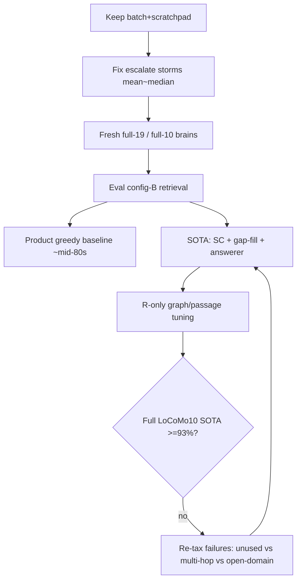

# 12 — ≥93% LoCoMo at low ingest multiplier

Goal: reach HyperMem-class **≥93%** LLM-as-a-judge on LoCoMo while keeping accurate-mode **ingest** multiplier near the shipped batch+scratchpad band (**~15–20× median**; mean not dragged back to ~100×+ by escalate storms).

Binding constraints: [`00-scope-and-constraints.md`](00-scope-and-constraints.md) (noise floor, product vs deep retrieval), [`08-sota-locomo-protocol.md`](08-sota-locomo-protocol.md) (SOTA track), [`11-architect-loop-efficiency-plan.md`](11-architect-loop-efficiency-plan.md) (batch/scratchpad ship state), [`07-event-graphrag-improvement-plan.md`](07-event-graphrag-improvement-plan.md) (retrieval levers).

**Plan only — no implementation in this document.**

---

## Snapshot (2026-07-30)

| Arm | Track | Scope | Judge | Ingest multiplier | Notes |
| --- | --- | --- | ---: | --- | --- |
| `locomo-batch-score` | **product** | conv-26 | **80.3%** | median **18.9×** / mean **78.2×** | Fresh `locomoconv26batch`; escalate storms on s10/13/14 |
| `locomo-batch-cfgb` | **product** | conv-26 | **84.2%** | same brain (no re-ingest) | Config-B retrieval; +3.9pp vs score; McNemar ns p=0.31 |
| `locomo-batch-nostorm-cfgb` | **product** | conv-26 | **85.5%** | median **87.8×** / mean **124.6×** | Fresh `locomoconv26nostorm`; cfg-B; ties best product point |
| `oldbrain-recheck-a` | product | conv-26 | **85.5%** | (pre-batch path) | Best `REPORTS.json` product (tied) |
| `phase-sota-d1-conv26` | **sota** | conv-26 | **84.9%** | (clean brain, pre-batch) | SC=3 + gap-fill; open-domain 69.2%; answerer gap 9.2% |
| `locomo-compose-sota-conv26-v2` | **sota** | conv-26 | **92.1%** | same as nostorm (no re-ingest) | Composition/traits/affect harness; McNemar vs cat3fix +10/−2 p=**0.039**; answerer gap **2.0%**; **≥93% miss** (~0.9pp) |
| `locomo-cat3fix-sota-conv26` | **sota** | conv-26 | **86.8%** | same as nostorm (no re-ingest) | Open-domain harness fix; cat3 **76.9%** (+30.7pp); gap **7.2%**; McNemar vs nostorm-sota +10/−7 p=0.63 (ns); **≥93% miss** |
| `locomo-nostorm-sota-conv26` | **sota** | conv-26 | **84.9%** | same as nostorm product (no re-ingest) | SC=5 + gap-fill on `locomoconv26nostorm`; cat3 **46.2%**; gap **9.2%**; eval tokens **39.1M**; McNemar vs nostorm-cfgb +7/−8 p=1.0 (ns); **≥93% miss** |
| `sota-locomo10-batch-compose` | **sota** | full LoCoMo10 | **81.0%** | median **45.6×** / mean **90.6×** | Fresh `locomof10c*`; SC=5+gap-fill+compose harness; n=1540; cat1 64.2% cat3 61.5%; answerer gap 12.7%; cost gates FAIL; **≥93% miss (~12 pp)** |
| HyperMem (paper) | — | full LoCoMo | **92.73%** | n/a | Different answerer/judge; not apples-to-apples |

`locomo-batch-score` category gaps: cat1 multi-hop **68.8%**, cat3 open-domain **61.5%**, cat2 **86.5%**, cat4 **85.7%**. EvR full **96.7%**; answerable **94.1%**; **answerer gap 13.8%**. Eval used config-A-ish knobs (`max_passages=8`, `max_facts=40`, `use_ppr=false`, `historical_limit=10`) — weaker than mid-80s product arms.

`locomo-batch-cfgb` (same brain, config-B): cat1 **84.4%**, cat3 **53.8%**, cat2 **83.8%**, cat4 **90.0%**; EvR full **98.7%**; answerer gap **9.9%**.

`locomo-batch-nostorm-cfgb` (storm-fixed brain, config-B): cat1 **84.4%**, cat2 **86.5%**, cat3 **53.8%**, cat4 **91.4%**; EvR full **99.3%**; answerer gap **8.6%**. McNemar vs score +17/−9 p=0.17; vs cfgb +8/−6 p=0.79.

`locomo-nostorm-sota-conv26` (same storm-fixed brain, **SOTA** SC=5 + gap-fill, no re-ingest): headline **84.9%** [78.3%, 89.7%]; cat1 **78.1%**, cat2 **86.5%**, cat3 **46.2%**, cat4 **94.3%**; EvR full **99.3%**; answerer gap **9.2%**; eval LLM tokens **39.1M** (vs product cfgb ~7.8M). McNemar vs `locomo-batch-nostorm-cfgb`: +7/−8 p=**1.0** (ns) — harness did not beat product 85.5%. **≥93% gate: miss** (~8 pp short on conv-26; full-10 still required for protocol claim).

`locomo-compose-sota-conv26-v2` (same brain, **SOTA** SC=5 + gap-fill + composition/traits/affect harness, no re-ingest): headline **92.1%** [86.7%, 95.4%]; cat1 **84.4%**, cat2 **91.9%**, cat3 **84.6%**, cat4 **97.1%**; EvR full **99.3%**; answerer gap **2.0%**; eval tokens **42.6M**. McNemar vs `locomo-cat3fix-sota-conv26`: +10/−2 p=**0.039** (significant). Residual 12 wrongs: education Psychology paraphrase, traits vocab SC, image-only book/symbol titles, charity Sunday≠Saturday dialogue, hike marshmallows, children count, a few temporal/painting items. **≥93% gate: miss** (~0.9 pp / 1–2 QAs). NOTES: `benchmarks/runs/locomo-compose-sota-conv26-v2/NOTES.md`.

`locomo-cat3fix-sota-conv26` (same brain, **SOTA** SC=5 + gap-fill + open-domain harness fix, no re-ingest): headline **86.8%** [80.5%, 91.3%]; cat1 **81.2%**, cat2 **86.5%**, cat3 **76.9%**, cat4 **91.4%**; EvR full **99.3%**; answerer gap **7.2%**; eval tokens **39.0M**. McNemar vs nostorm-sota +10/−7 p=**0.63** (ns); vs nostorm-cfgb +9/−7 p=**0.80** (ns). Cat3 **+30.7 pp** vs prior SOTA (46.2%→76.9%). Cat3-only probe hit **92.3%** once (SC variance; not the published estimate). **≥93% gate: miss** (~6.2 pp short on conv-26). Taxonomy + NOTES: `benchmarks/runs/locomo-nostorm-sota-conv26/cat3-failure-taxonomy.md`, `benchmarks/runs/locomo-cat3fix-sota-conv26/NOTES.md`.

Ship ingest path (doc `11`): `INGEST_ARCHITECT_MODE=batch` + scratchpad prior → **~15.3×** on sessions 1–5. Full-19 mean blew up because three sessions escalated into Architect tooler + heavy Janitor (s13 495k, s14 494k, s10 380k tokens). Excluding those three: mean ≈**18×**.

### Full-10 claim gate (2026-07-31)

`sota-locomo10-batch-compose`: full LoCoMo10 under compose SOTA harness on fresh batch+scratchpad brains → headline **81.0%** [78.9%, 82.9%] (n=1540). Ingest 272/272; mean/median multiplier **90.6× / 45.6×**; escalate **6.8%**; cost gates still **FAIL**. Best per-sample ~90% (conv-30); conv-26 **88.2%** (below prior nostorm compose-v2 **92.1%**). **Honest call: no HyperMem-class claim** (~12 pp below ≥93%). NOTES: `benchmarks/runs/sota-locomo10-batch-compose/NOTES.md`.

### Storm fix status (Task 1 / M0, 2026-07-30)

**Root cause:** s10/13/14 → `schema_empty_or_all_rejected` on entity-dense dialogue (Scout ~20+ EVENT hubs; schema empty). Escalate → tooler (≤10 turns) → Janitor ambiguous flood (14–21 LLM calls). Dialogue `\n` never split under 6000-char chunker.

**Shipped** (workspace + `~/.brainapi/source`): dense rechunk (≥12 entities / 1200 chars), line-aware chunking, soft-admit endpoints (+ UUID mint hotfix), escalate max **3**, Janitor LLM cap **2**, `tests/test_architect_escalation.py`.

**M0 re-ingest done** (`locomo-batch-ingest-nostorm`, brain `locomoconv26nostorm`, 19/19): s10/13/14 capped (**41k / 106k / 97k** vs prior **380k / 495k / 494k**). Escalate **12.9%** (11/85 units). Mean / median multiplier **124.6× / 87.8×** — **gates still FAIL** (target mean ≤30×, median 15–20×). Cost moved to other escalate→janitor sessions (s5/12/15/16/17). See `benchmarks/runs/locomo-batch-ingest-nostorm/NOTES.md`.

---

## 1. Honest gap analysis: 80.3% → 93% (~13 pts)

Do **not** claim ingest cost cuts alone get to 93%. Batch+scratchpad already hit the cost band; the quality gap is elsewhere. Approximate attribution (overlapping; not additive to 13):

| Bucket | Est. recoverable | Evidence | Caveat |
| --- | ---: | --- | --- |
| **(a) Product vs SOTA harness** | **~3–8 pts** on same brain | SOTA profile = SC (`sc_samples`≥3–5) + gap-fill + hardened prompt; protocol win condition is this track. Failure taxonomy (`sota-failure-taxonomy.md`): **100%** wrongs generation-side — present-but-unused ~7pp, multi-hop composition ~6pp, temporal format ~4pp. SC targets instability; gap-fill targets unused evidence. | Best measured SOTA on conv-26 is now **92.1%** (`locomo-compose-sota-conv26-v2`); prior **86.8%** / **84.9%**. McNemar vs cat3fix **significant** (p=0.039). Cat3 open-domain + composition/traits harness closed most of the answerer gap (7.2%→2.0%). Eval tokens ↑ (~43M SC=5 vs ~7.8M product). |
| **(b) Incomplete / stormy ingest** | **~0–3 pts** (recovery toward mid-80s product) | 19/19 completed, but escalate storms may distort graph on heavy sessions; batch brain **80.3%** sits **~5 pts** below best product (`85.5%`) and **~2–4 pts** below clean-brain product (~82–84%). | Not proven causal. Config-A retrieval on this eval likely explains part of the drop vs push75-c/d. Fix storms for **mean multiplier**, not as the main accuracy lever. |
| **(c) Retrieval / multi-hop graph** | **~0–4 pts** judge; larger EvR | Doc `07`: Phase B diversification failed EvR lift; Phase C hub-bridge EvR↑ did **not** convert to judge (McNemar ns). Cat1 graph EvR **81%** vs passages **78%** while judge **68.8%** — composition/answerer, not missing sessions (full EvR **96.9%**). Write-time topic index + coarse-to-fine (doc `08`) already landed. Remaining: novel-session retention, orphan hub bridges, answer-side paths. | Prefer retrieval-side metrics; judge may stay flat (Phase 1 / C3). **No new ingest LLM** for these. |
| **(d) Answerer / protocol** | **~8–14 pts** potential ceiling | Answerer gap **13.8%** this run; taxonomy says evidence often present. Temporal format + open-domain inference are answer-prompt / SC issues. | Shared-family judge → absolute % biased; paired McNemar still valid. Groundedness unmeasured. |
| **(e) Noise floor** | **~5–7 pts** unresolvable at n=152 | Doc `00`: identical-config spread 82.9%↔86.2%; CI ~±7. | Single-run “+2 pts” is unfalsifiable. Full LoCoMo10 helps power; still report CIs + McNemar. |

**Bottom line:** ~13 pts is a **stack** problem. Rough order of real leverage: **(d)+(a) harness/answer** first, **config-B retrieval defaults** (cheap), **storm-free full ingest** (multiplier + hygiene), then **graph channel** only where EvR/composition metrics move. Ingest multiplier work is a **constraint**, not the accuracy engine.

**Scope honesty:** Protocol win is **full LoCoMo10** under `BENCH_PROFILE=sota`, not conv-26 alone. Conv-26 is the fast loop; full-10 is the claim gate.

---

## 2. What to keep for the multiplier

Keep as product accurate defaults (doc `11` CP2/CP3):

- `INGEST_ARCHITECT_MODE=batch` (pure schema extract, ≤2 calls/unit happy path)
- `INGEST_ARCHITECT_PRIOR_CONTEXT=auto` → scratchpad (≤500 tokens; measured **15.3×** vs raw **23.6×**)
- Escalate **only** on empty/invalid coverage (schema fail → one repair → tooler last), not as a soft quality preference
- Janitor exception-only via grounding triage; observations / consolidator off for cost arms

**Fix escalate storms (s10/13/14 pattern):** mean **78×** vs median **19×** is unacceptable for the dual goal.

| Action | Why | Ingest tokens? |
| --- | --- | --- |
| Cap per-unit escalate budget (already resolved ≤10 tool turns) and **fail partial** instead of unbounded Janitor loops | Storms show architect 12 calls + janitor 21 calls / ~420k janitor tokens on outliers | Cuts ingest |
| Raise deterministic accept / realign so heavy sessions stay on batch path | Happy-path sessions already ~10–30k tokens | Cuts ingest |
| Telemetry: escalate rate, reason, max calls/unit on every full-19 ingest | Gate mean ≈ median | Measure only |
| **Do not** “fix quality” by re-enabling tooler-default or raw prior | Returns ~300–800× | Forbidden |

Acceptance for multiplier: full-19 conv-26 ingest **median 15–20×**, **mean ≤30×** (stretch ≤25×), escalate rate **&lt;10%** of units, zero silent unbounded loops.

---

## 3. Path to ≥93% (ordered by expected pts / multiplier risk)

Explicit token class: **I** = ingest LLM, **E** = eval/answer/judge LLM, **R** = retrieval compute only (no LLM).

| # | Lever | Est. pts | Mult. risk | Tokens | Notes |
| ---: | --- | ---: | --- | --- | --- |
| 1 | **Eval on config-B retrieval** (`use_ppr`, `max_passages=16`, `max_facts=50`, `historical_limit=16`) matching mid-80s arms | +1–4 (recover toward 82–85) | None | **R** | Batch-score used config A; trivial. Product path still ADR-006. |
| 2 | **SOTA harness** on a clean full-19 brain: `BENCH_PROFILE=sota`, deepseek-v4-flash, SC=5, gap-fill on, prompt-audit green | +3–8 vs same-brain product | None | **E** | Required for 93 claim (`08`). Does not touch ingest. Always report greedy product alongside. |
| 3 | **Storm-free full-19 (then full-10) ingest** under batch+scratchpad | +0–3 quality; **required for mean ~19×** | Fixes mean | **I↓** | Fresh brains; graph audit gates from `11` Task 4.1. |
| 4 | **Answerer / protocol** (hardened prompt, temporal format rules, SC majority, gap-fill re-retrieve) per `08` + taxonomy | +5–10 of the answerer gap | None | **E** | Primary path for cat3 + present-but-unused. No gold-fitting. |
| 5 | **Retrieval/graph without ingest LLM** from `07`/`02`: topic coarse-to-fine (landed), reserved novel-session bridge slots, orphan hub-bridge spine widen, query–edge embedding rank, session/hub diversify under budget | +0–4 judge; EvR/cat1 first | None on ingest; watch p50 | **R** (+ tiny **I** only if write-time hub-bridge rebuild on ingest — index build, not Architect loop) | Do not expect judge miracles; Phase C3 already showed EvR≠answers. |
| 6 | **Deep/MCP composition** for residual multi-hop (ToG-style) | optional SOTA-only | None on product ingest | **E** at query | Not on `/retrieve/context`. Optional harness agent — separate from product claim. |

**Explicit non-claims**

- Cutting Architect tokens further (cascade, distill) will **not** deliver 93%.
- Hub-bridge EvR lifts alone will **not** deliver 93% (already measured).
- Product greedy `/retrieve/context` is **not** required to hit 93%; the protocol puts SC/gap-fill in the **harness**.

---

## 4. Milestone table

| Milestone | Target judge | Multiplier | Run | Acceptance |
| --- | ---: | --- | --- | --- |
| **M0** Storm-fixed ingest | n/a | median 15–20×, mean ≤30× on conv-26×19 | `locomo-batch-ingest-nostorm` | **Partial:** s10/13/14 capped; escalate 12.9%; mean **124.6×** / median **87.8×** — multiplier gates still red (janitor after escalate on other sessions) |
| **M1** Product recover | ≥83% point, CI overlaps best product | same as M0 | `locomo-batch-nostorm-cfgb` | **Done:** **85.5%** on M0 brain (cfg-B); ties `oldbrain-recheck-a`; McNemar vs score ns p=0.17; vs stormy cfgb ns p=0.79 |
| **M2** SOTA conv-26 | ≥88% aspirational; **≥86%** gate | unchanged (eval-only) | `locomo-compose-sota-conv26-v2` | **Partial→strong:** **92.1%** (above aspirational 88%); McNemar vs cat3fix +10/−2 p=**0.039**; prompt-audit green; still **~0.9pp short of HyperMem 93%** |
| **M3** Full LoCoMo10 SOTA | **≥93%** headline | median ~15–20× on sampled sessions; mean ≤30× | `sota-locomo10-*` per `08` | Protocol sheet: full-10, non-adversarial, deepseek-v4-flash, SC=5, gap-fill; also publish product greedy; memory-off ablation |
| **M4** Dual gate | M3 holds | mean stays near median after any ingest change | paired re-ingest subset | McNemar ns regression vs M3; multiplier gate still green |

Compare with `./locomo.sh compare` (exact McNemar). Do not treat noise-floor wiggles as wins.

---

## 5. Top 5 tasks (planning style)

### Task 1 — Kill escalate storms on heavy sessions

**Description:** Diagnose s10/13/14 triggers (schema_partial_reject, grounding ambiguous flood, call budget). Enforce hard per-unit caps, partial/degraded status on exhaustion, and deterministic realign/accept so Janitor stays exceptional on long sessions.

**Acceptance:** Full-19 re-ingest mean multiplier ≤30× with median 15–20×; escalate rate &lt;10%; no session &gt;100k LLM tokens without an explicit logged budget-exhaustion status; pytest covers budget exhaustion.

**Status (2026-07-30):** Code + tests + live sync shipped; full-19 re-ingest **done** (`locomo-batch-ingest-nostorm`). Acceptance **not met** on mean/median multiplier (124.6× / 87.8×) or escalate &lt;10% (12.9%). Former s10/13/14 storms capped; residual cost is escalate→tooler→janitor on other dense sessions. Soft-admit UUID mint hotfix required mid-run.

**Tokens:** **I↓**. Size: M.

### Task 2 — Product cfg-B eval on storm-fixed brain

**Description:** Fresh evaluate with `use_ppr=true`, `max_passages=16`, `max_facts=50`, `historical_limit=16`, product profile, same answer/judge models as batch-score.

**Acceptance:** Manifest records flags; McNemar vs `locomo-batch-score`; passage EvR not below prior; headline point estimate ≥83% or documented failure analysis. Upsert `REPORTS.json` only if `status=ok`.

**Status (2026-07-30):** Stormy-brain stand-in `locomo-batch-cfgb` **84.2%**. **Re-run on M0 brain done** as `locomo-batch-nostorm-cfgb`: judge **85.5%** [79.1%, 90.2%]; EvR full 99.3%; answerer gap 8.6%; McNemar vs score +17/−9 p=0.17; vs cfgb +8/−6 p=0.79. NOTES at `benchmarks/runs/locomo-batch-nostorm-cfgb/NOTES.md`. `REPORTS.json` upserted.

**Tokens:** **R** + **E** (eval). Size: S.

### Task 3 — SOTA harness pass on same brain (conv-26)

**Description:** `BENCH_PROFILE=sota`, SC=5, gap-fill on, deepseek-v4-flash, prompt-audit. Optionally harden temporal/open-domain answer instructions without gold-fitting.

**Acceptance:** Prompt-audit green; McNemar vs Task-2 product; answerer gap ↓ vs 13.8% or taxonomy shows shift out of `present_but_unused`; cat3 and cat1 point estimates reported. No ingest flag changes.

**Status (2026-07-30):** Open-domain pass landed (`locomo-cat3fix-sota-conv26`): prompt-audit green; cat3 **46.2%→76.9%**; overall **84.9%→86.8%**. Follow-on composition/traits pass (`locomo-compose-sota-conv26-v2`): overall **86.8%→92.1%**; answerer gap **7.2%→2.0%**; McNemar vs cat3fix +10/−2 p=**0.039**. Residual ~12 wrongs (education Psychology paraphrase, traits vocab SC, image-only titles, annotator day mismatch, a few multi-hop/temporal). Next: optional caption/title retrieval for image-grounded golds + Task 4 full-10 — do **not** claim ≥93% yet (miss by ~0.9pp on conv-26).

**Tokens:** **E** only. Size: M.

### Task 4 — Full LoCoMo10 SOTA claim run

**Description:** Storm-fixed batch+scratchpad ingest across LoCoMo10; evaluate per `08` / `run_sota_locomo10.sh`; report product greedy + SOTA + memory-off.

**Acceptance:** Headline SOTA ≥93% or stop with failure taxonomy on full-10; multiplier gates on a pinned session sample; absolute claims caveated (shared-family judge). McNemar vs prior best REPORTS SOTA entry where question sets overlap.

**Tokens:** **I** (ingest once) + **E** (heavy). Size: L.

### Task 5 — Retrieval-only multi-hop / unused-evidence fixes (no Architect loop)

**Description:** From `07` residual: keep novel-session bridge facts under `max_facts`; widen orphan hub-bridge predicates if session_11-class gaps remain; ensure topic coarse-to-fine + paths composition feed the SOTA answerer. No new ingest agent turns.

**Acceptance:** Stable graph EvR agreement ≥95% before A/B; multi-hop EvR or answerable↑ on cat1; judge McNemar secondary (may be ns). Context p50 regression within maintainer tax vs ADR-006.

**Status (2026-07-30):** Harness-side composition (Task 3 follow-on) moved judge **86.8%→92.1%** without retrieve/`src` changes; EvR already 99.3%. Remaining multi-hop misses are mostly present-but-unused (marshmallows), image-caption golds, or count errors — optional next: surface image `query`/`blip_caption` in answer context if already stored, or reserved novel-session slots only if EvR on those QAs drops. Do not expect +4pp from graph alone.

**Tokens:** **R** (+ optional write-time index rebuild **I**≠Architect). Size: M.

---

## What not to do

- Do not trade back to tooler-default Architect to chase a point of judge accuracy.
- Do not add query-time LLM loops on `/retrieve/context` for the 93% claim.
- Do not ship on a single conv-26 point estimate without McNemar + CI.
- Do not equate ingest multiplier reduction with LoCoMo accuracy gains.
- Do not compare absolute deepseek-judge % to HyperMem’s GPT-4o-mini judge without labeling the protocol gap.

---

## Related docs

- [`00-scope-and-constraints.md`](00-scope-and-constraints.md) — noise floor, dual retrieval tiers
- [`07-event-graphrag-improvement-plan.md`](07-event-graphrag-improvement-plan.md) — graph EvR / hub-bridge ship state
- [`08-sota-locomo-protocol.md`](08-sota-locomo-protocol.md) — ≥93% win condition
- [`11-architect-loop-efficiency-plan.md`](11-architect-loop-efficiency-plan.md) — batch+scratchpad cost ship state
- [`13-locomo-93-research-levers.md`](13-locomo-93-research-levers.md) — literature-backed levers for the last ~1pp / full-10 gap
- [`benchmarks/AGENTS.md`](../../benchmarks/AGENTS.md) — product vs SOTA tracks
- Latest product batch run: `benchmarks/runs/locomo-batch-score/`
